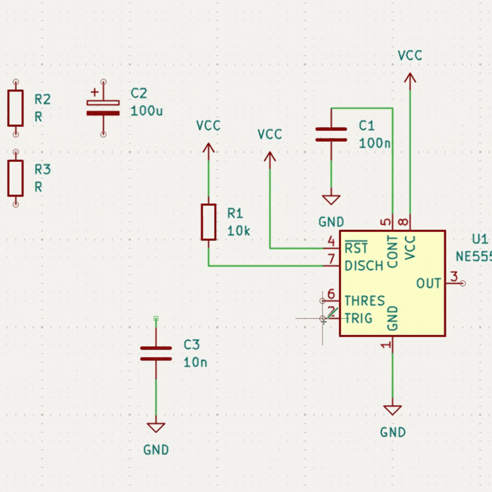

  

<h1 align="center">🌸 Clase 08a — Primer acercamiento a ![KiCad] (https://www.youtube.com/channel/UCietjxpksncMdOUkycv5nqA) 🌸</h1>

  <b>Bitácora de clase — Diseño de circuitos y placas PCB</b> 
  En esta sesión comenzamos a trabajar con KiCad para pasar de un circuito esquemático a una placa física.

<!-- Aqui empieza el gif del circuito -->

  

<!-- Aqui termina el gif del circuito -->

